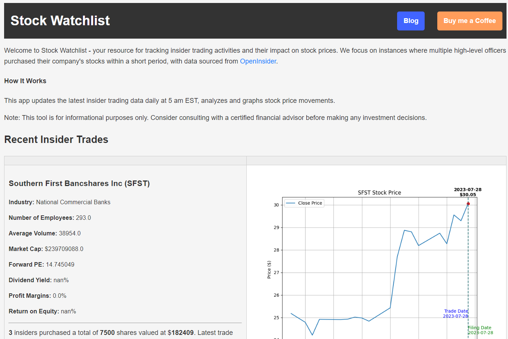

Had some great feedback and built a modern version of this app at https://www.insidetrader.site/


# Insider Trading Analysis Tool
This project is a bot designed to track and alert users when multiple high-level insiders (CEOs, CFOs, etc.) buy their own company's stock on the same day. This repository contains lightweight code for a Flask application that scrapes data and displays it on a webpage. The data is updated daily at 5 am EST.

Inspired by [this video](https://www.youtube.com/watch?v=bhxblVMqsbo) by Calum Shallenberger

## Live Site
You can view the live site at http://joshwdev.pythonanywhere.com/.


## Project Overview

This tool provides an analysis of recent insider trading activities, helping investors understand how stock prices move in response to these events. The tool scrapes data from [OpenInsider](http://openinsider.com/latest-cluster-buys), analyzes the stock performance before and after the insider trades, and presents this data in a user-friendly manner through a Flask web application.

## System Architecture

The system is composed of three main components:

1. **Data Scraping**: A Python script that uses `requests` and `BeautifulSoup` libraries to scrape insider trading data from OpenInsider and save it as a CSV file.

2. **Data Analysis and Visualization**: A Python script that uses `pandas` and `matplotlib` libraries to analyze the scraped data, fetch related stock price data, calculate the percentage change in stock prices, and generate plots showing the stock price movement over time.

3. **Web Application**: A Flask web application that presents the data and visualizations to the end-user in an easy-to-understand format.

## Features

- **Insider Trading Data**: Displays information about recent insider trading activities, including the filing date, trade date, ticker, company name, industry, insider's name, trade type, price, quantity, owned, ΔOwn, and value.

- **Stock Performance Analysis**: Provides a visual representation of how the stock price moved before and after the insider trade.

- **Research Links**: Provides direct links to OpenInsider and Yahoo Finance for each ticker, allowing users to conduct further research.

## Usage

1. Run the main file to call the data scraping script to fetch the latest insider trading data, analyze the stock performance and generate visualizations.

```
python main.py
```

3. Launch the Flask application to view the data and visualizations in a web browser. By default it will run [locally on port 5000](http://127.0.0.1:5000)
```
python app.py
```


## Note

This tool should be used for informational purposes only. Always conduct your own research and consider seeking advice from a certified financial advisor before making any investment decisions.

## Future Enhancements

- Automate the data scraping and analysis processes to provide real-time insights.
- Extend the Flask application to include more features, such as allowing users to search for specific tickers, displaying more detailed stock performance analysis, etc.
- Incorporate more data sources to provide a comprehensive overview of insider trading activities.

## Disclaimer

Insider trading data is provided by OpenInsider. The analysis and conclusions drawn from this data are the work of this application and should not be considered financial advice. Always conduct your own research before making investment decisions.
